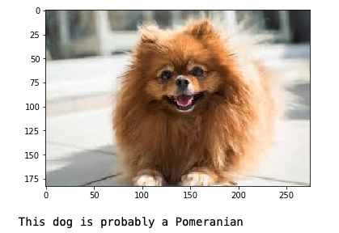
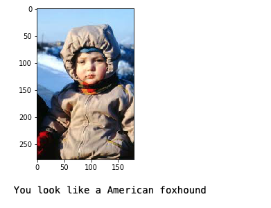

# Dog Breed Classifier

Dog breed classifier uses deep learning to identify a dog's breed or a dog breed that resembles a human

Libraries used:

- Pytorch (torch & torchvision) for transfer learning based on pre-trained VGG16
- cv2 for face detection
